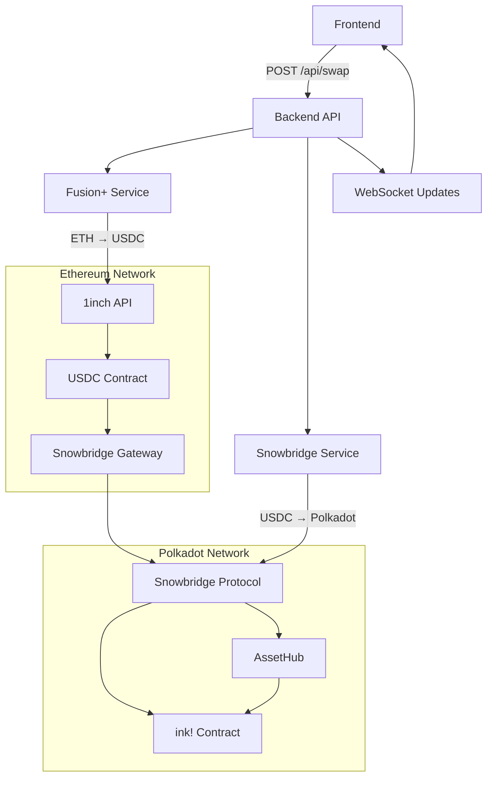
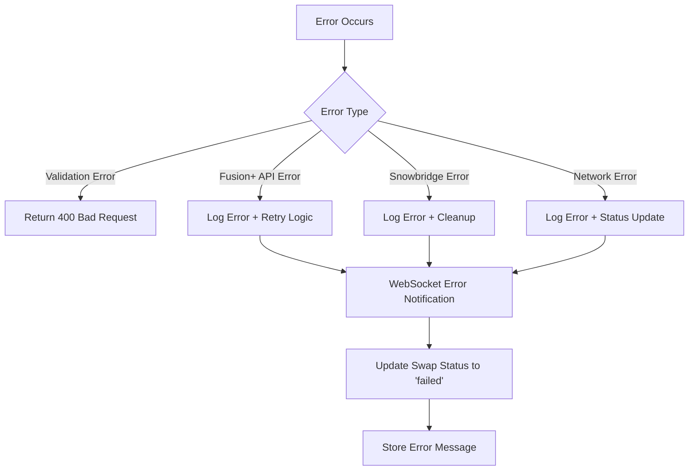

# FlipPay Cross-Chain Swap Integration Flow

This document explains the complete integration flow for cross-chain ETH ↔ DOT swaps using Fusion+ and Snowbridge protocols.

## Architecture Overview



## Complete Flow Breakdown

### Phase 1: Request Initiation (Frontend → Backend)

1. **Frontend Request**
   ```json
   POST /api/swap
   {
     "fromEthToDot": true,
     "payAmount": "0.1",
     "ethAddress": "0x742d35Cc6634C0532925a3b8D7389d80dDdBB40a",
     "dotAddress": "5GrwvaEF5zXb26Fz9rcQpDWS57CtERHpNehXCPcNoHGKutQY"
   }
   ```

2. **Backend Validation**
   - Validates Ethereum address format
   - Validates amount > 0
   - Validates required fields
   - Generates unique `swapId`

3. **Immediate Response**
   ```json
   {
     "success": true,
     "swapId": "uuid-string",
     "message": "Swap initiated successfully",
     "estimatedTime": "5-10 minutes"
   }
   ```

4. **WebSocket Notification**
   ```json
   {
     "swapId": "uuid-string",
     "status": "initiated",
     "message": "Swap request received and validated",
     "timestamp": "2024-01-01T00:00:00.000Z"
   }
   ```

### Phase 2: Fusion+ ETH → USDC Swap

5. **Fusion+ Quote Request**
   ```
   GET https://api.1inch.dev/swap/v6.0/1/swap
   Parameters:
   - src: 0xEeeeeEeeeEeEeeEeEeEeeEEEeeeeEeeeeeeeEEeE (ETH)
   - dst: 0xA0b86a33E6441066CE6b8B0d5A5a57d4E47e0b12 (USDC)
   - amount: {eth_amount_in_wei}
   - from: {user_eth_address}
   - slippage: 1%
   ```

6. **WebSocket Update**
   ```json
   {
     "swapId": "uuid-string",
     "status": "fusion_swap",
     "message": "Swapping ETH to USDC using Fusion+",
     "timestamp": "2024-01-01T00:01:00.000Z"
   }
   ```

7. **Fusion+ Response Processing**
   ```json
   {
     "dstAmount": "150000000", // USDC amount (6 decimals)
     "tx": {
       "to": "0x...",
       "data": "0x...",
       "value": "100000000000000000", // 0.1 ETH in wei
       "gas": "150000",
       "gasPrice": "20000000000"
     }
   }
   ```

8. **Transaction Execution**
   - Sign transaction with Ethereum private key
   - Submit to Ethereum network
   - Wait for confirmation
   - Record transaction hash

### Phase 3: Snowbridge USDC → Polkadot Bridge

9. **Snowbridge Setup**
   ```typescript
   // Initialize context and wallets
   const context = new Context(contextConfigFor(environment));
   const ethereumWallet = new Wallet(privateKey, context.ethereum());
   const polkadotAccount = keyring.addFromUri(substrateKey);
   ```

10. **Bridge Fee Calculation**
    ```typescript
    const fee = await toPolkadotV2.getDeliveryFee(
      context,
      registry,
      usdcContractAddress,
      destinationParachain // 1000 for AssetHub
    );
    ```

11. **WebSocket Update**
    ```json
    {
      "swapId": "uuid-string",
      "status": "bridging",
      "message": "Bridging USDC to Polkadot using Snowbridge",
      "timestamp": "2024-01-01T00:03:00.000Z"
    }
    ```

12. **Bridge Transfer Creation**
    ```typescript
    const transfer = await toPolkadotV2.createTransfer(
      registry,
      ethereumAddress,
      polkadotAddress,
      usdcContractAddress,
      destinationParachain,
      usdcAmount,
      fee
    );
    ```

13. **Transfer Validation**
    ```typescript
    const validation = await toPolkadotV2.validateTransfer(context, transfer);
    if (!validation.success) {
      throw new Error('Bridge transfer validation failed');
    }
    ```

14. **Bridge Transaction Submission**
    - Submit bridge transaction to Ethereum
    - Wait for confirmation
    - Extract message ID for tracking

### Phase 4: Cross-Chain Message Processing

15. **Message Tracking**
    ```typescript
    const message = await toPolkadotV2.getMessageReceipt(receipt);
    // Returns: { messageId, blockNumber, txHash }
    ```

16. **Status Monitoring Loop**
    ```typescript
    while (true) {
      const status = await historyV2.toPolkadotTransferById(
        context.graphqlApiUrl(),
        messageId
      );
      
      if (status.status !== TransferStatus.Pending) {
        break; // Transfer completed
      }
      
      await setTimeout(60_000); // Wait 60 seconds
    }
    ```

### Phase 5: Polkadot Reception & ink! Contract

17. **AssetHub Processing**
    - Snowbridge relayers process the message
    - USDC tokens are minted on AssetHub
    - Tokens are transferred to destination address

18. **ink! Contract Interaction** (Optional)
    ```rust
    #[ink(message, payable)]
    pub fn receive_tokens(&mut self, token_contract: AccountId) -> Result<(), Error> {
        let caller = self.env().caller();
        let amount = self.env().transferred_value();
        
        // Update balances
        self.user_balances.insert(&caller, &amount);
        
        // Emit event
        self.env().emit_event(TokensReceived {
            from: caller,
            token_contract,
            amount,
            timestamp: self.env().block_timestamp(),
        });
        
        Ok(())
    }
    ```

19. **Final WebSocket Update**
    ```json
    {
      "swapId": "uuid-string",
      "status": "completed",
      "message": "Swap completed successfully",
      "timestamp": "2024-01-01T00:08:00.000Z"
    }
    ```

## Error Handling Flow



### Error Scenarios

1. **Validation Errors** (400 Response)
   - Invalid Ethereum address
   - Invalid amount
   - Missing required fields

2. **Fusion+ Errors**
   - API rate limit exceeded
   - Insufficient liquidity
   - Network congestion

3. **Snowbridge Errors**
   - Bridge validation failure
   - Insufficient gas for bridge fee
   - Cross-chain message timeout

4. **Network Errors**
   - Ethereum network congestion
   - Polkadot network issues
   - RPC connection failures

## Timeline Expectations

| Phase | Typical Duration | Description |
|-------|------------------|-------------|
| Validation | < 1 second | Request validation and response |
| Fusion+ Quote | 1-3 seconds | Get swap quote from 1inch |
| Fusion+ Execution | 1-5 minutes | Ethereum transaction confirmation |
| Bridge Submission | 30-60 seconds | Submit bridge transaction |
| Cross-chain Processing | 2-8 minutes | Relayer processing and Polkadot confirmation |
| **Total Time** | **5-15 minutes** | End-to-end completion |

## Status Progression

```
initiated → fusion_swap → bridging → completed
     ↓           ↓           ↓           ↓
   (0-10%)    (10-50%)    (50-90%)    (100%)
```

## WebSocket Message Types

### Progress Updates
```json
{
  "type": "progress",
  "swapId": "uuid",
  "status": "fusion_swap",
  "message": "Processing ETH to USDC swap...",
  "progress": 25,
  "timestamp": "2024-01-01T00:00:00.000Z"
}
```

### Transaction Updates
```json
{
  "type": "transaction",
  "swapId": "uuid",
  "txHash": "0x...",
  "network": "ethereum",
  "confirmations": 3,
  "timestamp": "2024-01-01T00:00:00.000Z"
}
```

### Error Notifications
```json
{
  "type": "error",
  "swapId": "uuid",
  "error": "Fusion+ swap failed: Insufficient liquidity",
  "timestamp": "2024-01-01T00:00:00.000Z"
}
```

## Security Considerations

1. **Private Key Management**
   - Never log private keys
   - Use environment variables
   - Consider hardware security modules for production

2. **Rate Limiting**
   - Implement API rate limiting
   - Monitor for abuse patterns
   - Set reasonable swap limits

3. **Validation**
   - Validate all user inputs
   - Verify transaction signatures
   - Check destination addresses

4. **Monitoring**
   - Log all transactions
   - Monitor bridge status
   - Alert on failures

## Integration Testing

### Unit Tests
- Service layer validation
- Error handling scenarios
- WebSocket message formatting

### Integration Tests
- End-to-end swap flow
- Error recovery scenarios
- Network failure simulation

### Load Tests
- Concurrent swap handling
- WebSocket connection limits
- API rate limit testing

This comprehensive flow ensures reliable, traceable, and user-friendly cross-chain swaps between Ethereum and Polkadot ecosystems. 